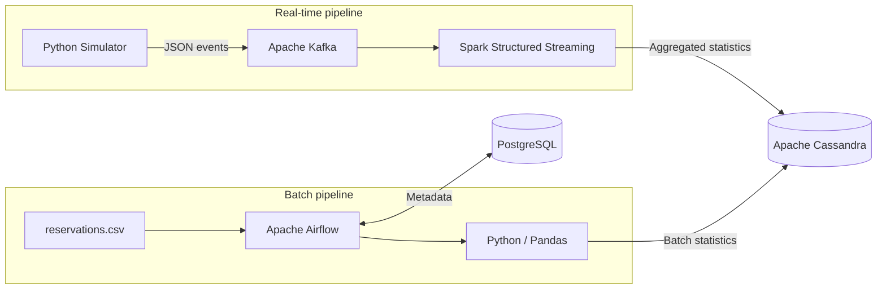

# TravelFlow Data Pipeline

TravelFlow is an end-to-end data engineering and DevOps portfolio project that demonstrates both real-time streaming and batch processing workflows using Apache Kafka, Apache Spark, Apache Cassandra, Apache Airflow, PostgreSQL, Docker Compose, Python, Pandas, and GitHub Actions.
The project was designed as an integration exercise to connect multiple technologies into one reproducible data platform.
Highlights
- Real-time event ingestion with Apache Kafka
- Stream processing with Spark Structured Streaming
- Batch orchestration with Apache Airflow
- Historical data analysis with Pandas
- NoSQL persistence with Apache Cassandra
- Airflow metadata storage with PostgreSQL
- Local multi-service deployment with Docker Compose
- Continuous integration with GitHub Actions
- End-to-end validation of both streaming and batch pipelines
Architecture

Real-time flow
Python Simulator
      ↓
Apache Kafka
      ↓
Spark Structured Streaming
      ↓
Apache Cassandra
Batch flow
reservations.csv
      ↓
Apache Airflow
      ↓
Python / Pandas
      ↓
Apache Cassandra

Airflow metadata
      ↓
PostgreSQL
Technology Stack
Technology	Role
Python	Event simulation and batch logic
Apache Kafka 4.3.1	Real-time event ingestion
Apache Spark 3.5.1	Structured Streaming and aggregation
Apache Cassandra 5.x	NoSQL storage
Apache Airflow 2.10.5	Batch orchestration
PostgreSQL 16	Airflow metadata database
Pandas	Batch data analysis
Docker Compose	Local service orchestration
GitHub Actions	Continuous integration

Project Structure
travelflow-data-pipeline/
├── .github/
│   └── workflows/
│       └── ci.yml
│
├── airflow/
│   ├── Dockerfile
│   ├── dags/
│   │   └── travelflow_batch_dag.py
│   └── logs/
│
├── data/
│   └── reservations.csv
│
├── simulator/
│   └── generate_events.py
│
├── spark/
│   ├── streaming_consumer.py
│   ├── streaming_to_cassandra.py
│   └── test_cassandra_write.py
│
├── .gitignore
├── docker-compose.yml
└── README.md
Real-Time Pipeline
1. Event Simulation
The Python simulator generates synthetic TravelFlow user activity such as:
- view_destination
- view_package
- start_booking
- booking_abandoned
- booking_completed
Each event contains fields such as:
{
  "event_id": "uuid",
  "user_id": "U1234",
  "event_type": "view_package",
  "destination": "Paris",
  "package_id": "PKG105",
  "price": 1700,
  "timestamp": "2026-10-03T..."
}
2. Kafka Ingestion
Events are published to:
travelflow-events
Kafka listeners are configured for:
Windows host: localhost:9092
Docker network: kafka:29092
This allows both local applications and Docker services to communicate with the broker.
3. Spark Structured Streaming
Spark consumes the Kafka topic, parses the JSON payload, and aggregates events by destination.
A reduced shuffle configuration is used for the local development environment:
spark.conf.set("spark.sql.shuffle.partitions", "5")
The aggregated results are written to Cassandra.
4. Cassandra Real-Time Storage
Keyspace:
travelflow
Table:
CREATE TABLE destination_stats (
    destination text PRIMARY KEY,
    event_count bigint
);
Validated streaming result
Destination	Event Count
New York	29
Montreal	23
Rome	20
Paris	15
Cancun	23

Batch Pipeline
1. Historical Data Source
The batch pipeline uses:
data/reservations.csv
The dataset contains 20 sample reservations with:
- reservation ID
- user ID
- destination
- package ID
- amount
- status
- reservation date
2. Airflow DAG
DAG:
travelflow_batch_analysis
Task:
analyse_reservations
Schedule:
@daily
The DAG performs the following steps:
1. Reads the CSV file with Pandas
2. Groups reservations by destination
3. Calculates reservation KPIs
4. Connects to Cassandra
5. Writes the aggregated results
3. Batch KPIs
For each destination, the pipeline calculates:
- Total reservations
- Completed reservations
- Abandoned reservations
- Total revenue from completed reservations
4. Cassandra Batch Storage
CREATE TABLE batch_booking_stats (
    destination text PRIMARY KEY,
    total_reservations int,
    completed_reservations int,
    abandoned_reservations int,
    total_revenue double
);
Validated batch result
Destination	Total	Completed	Abandoned	Revenue
New York	4	3	1	5400
Montreal	4	3	1	2600
Rome	4	3	1	4000
Paris	4	3	1	4700
Cancun	4	3	1	6800

The final Airflow validation included multiple successful DAG runs after the Cassandra connectivity issue was resolved.
Airflow Architecture
The final Airflow configuration separates responsibilities into dedicated services:
airflow-init
airflow-webserver
airflow-scheduler
postgres
PostgreSQL is used instead of SQLite for Airflow metadata.
This setup was more stable in Docker Desktop and supports the LocalExecutor.
Airflow UI:
http://localhost:8081
Local demo account:
Username: admin
Password: admin
The credentials above are only for the local demonstration environment.

Continuous Integration
GitHub Actions automatically validates the project on every push and pull request.
Workflow:
.github/workflows/ci.yml
The CI pipeline performs:
Git Push / Pull Request
          ↓
Checkout Repository
          ↓
Setup Python
          ↓
Install Dependencies
          ↓
Validate Python Syntax
          ↓
Validate Docker Compose
          ↓
Build Airflow Image
          ↓
CI Success / Failure
Current status:
Passing
Running the Project
Prerequisites
Install:
- Docker Desktop
- Git
- Python 3.x
Clone the Repository
git clone https://github.com/mahsanaji84/travelflow-data-pipeline.git
cd travelflow-data-pipeline
Run the Batch Pipeline
Start PostgreSQL and Cassandra:
docker compose up -d postgres cassandra
Initialize Airflow:
docker compose up airflow-init
Start Airflow:
docker compose up -d airflow-webserver airflow-scheduler
Open:
http://localhost:8081
Trigger:
travelflow_batch_analysis
Run the Real-Time Pipeline
Start the required services:
docker compose up -d kafka spark cassandra
Create the Kafka topic if required:
docker exec -it travelflow-kafka \
  /opt/kafka/bin/kafka-topics.sh \
  --create \
  --topic travelflow-events \
  --bootstrap-server localhost:9092 \
  --partitions 1 \
  --replication-factor 1
Run Spark Structured Streaming:
docker exec -it travelflow-spark \
  /opt/spark/bin/spark-submit \
  --conf spark.jars.ivy=/tmp/spark-home/.ivy2 \
  --packages org.apache.spark:spark-sql-kafka-0-10_2.12:3.5.1,com.datastax.spark:spark-cassandra-connector_2.12:3.5.1 \
  /opt/travelflow/spark/streaming_to_cassandra.py
Run the event producer:
python simulator/generate_events.py
Validate Results
Open Cassandra:
docker exec -it travelflow-cassandra cqlsh
Use the TravelFlow keyspace:
USE travelflow;
Streaming results:
SELECT * FROM destination_stats;
Batch results:
SELECT * FROM batch_booking_stats;
Engineering Challenges Solved
Spark / Cassandra Compatibility
An initial Spark version was not aligned with the Cassandra connector.
Solution: standardize the environment on Spark 3.5.1 with the compatible Cassandra connector.
Spark Shuffle Overhead
The default shuffle partition count was too high for the small local dataset.
Solution:
spark.sql.shuffle.partitions = 5
Cassandra Readiness
Cassandra can require additional startup time before port 9042 accepts connections.
Solution: validate service readiness before triggering dependent workloads.
Airflow Stability
The initial setup used SQLite and combined Airflow components in one container.
This caused:
- heartbeat delays
- Gunicorn worker failures
- webserver instability
Solution:
- PostgreSQL metadata database
- dedicated Airflow webserver
- dedicated Airflow scheduler
- separate Airflow initialization service
Airflow Dependency Compatibility
Custom Python packages initially introduced dependency incompatibilities.
Solution: rebuild the Airflow image using the official Airflow constraints file for Airflow 2.10.5 and Python 3.12.
Validation:
python -m pip check
Result:
No broken requirements found.
Docker Desktop Resource Usage
Running Kafka, Spark, Cassandra, PostgreSQL, Airflow Webserver, and Airflow Scheduler simultaneously can be resource-intensive on a local machine.
Solution: validate the streaming and batch pipelines independently when troubleshooting.
Screenshots
Recommended screenshots for the portfolio:
docs/images/
├── airflow-success.png
├── cassandra-batch-results.png
├── spark-streaming-results.png
└── github-actions-ci.png
After adding the images, you can display them here:

What This Project Demonstrates
This project demonstrates practical experience with:
- Data engineering
- Streaming architectures
- Batch processing
- Workflow orchestration
- Distributed data processing
- NoSQL databases
- Container networking
- Docker Compose
- CI automation
- Troubleshooting multi-service environments
- Service dependency management
- End-to-end pipeline validation
Future Improvements
Possible next steps:
- Add Kafka persistent volumes
- Add health checks for Kafka, Cassandra, and Airflow
- Move credentials to environment variables / secrets
- Add automated unit and integration tests
- Add a visualization layer such as Power BI or Streamlit
- Add Docker image publishing to Docker Hub
- Extend GitHub Actions from CI to CI/CD
- Deploy the architecture to Kubernetes
- Deploy to a cloud platform
- Add recommendation or prediction models
Author
Mahsa Najimoghadam
Computer Science graduate and Big Data / Business Intelligence student building practical projects in:
- Data Engineering
- Data Analytics
- Business Intelligence
- Machine Learning
- DevOps
